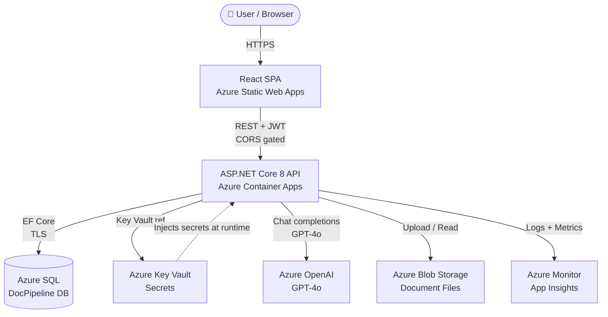

# DocPipeline — Architecture & Interview Guide

## 1. High-Level Context Diagram



---

## 2. Service / Container Diagram with Data Flows

```mermaid
sequenceDiagram
    participant Browser
    participant Frontend as React SPA<br/>(Static Web Apps)
    participant API as API Container<br/>(Container Apps)
    participant Worker as Background Worker<br/>(IHostedService in API)
    participant Queue as Channel&lt;Guid&gt;<br/>(in-process)
    participant SQL as Azure SQL
    participant Blob as Azure Blob
    participant OpenAI as Azure OpenAI

    Note over Browser,Frontend: CORS boundary enforced at API
    Browser->>Frontend: POST /api/auth/login
    Frontend->>API: POST /api/auth/login (JSON)
    API->>SQL: Validate identity hash
    SQL-->>API: IdentityUser
    API-->>Frontend: JWT (HS256, 60 min)
    Frontend-->>Browser: Store JWT in localStorage

    Browser->>Frontend: Upload invoice.pdf
    Frontend->>API: POST /api/documents (multipart, Bearer)
    API->>API: Validate content-type + size
    API->>Blob: Save file → storagePath
    API->>SQL: INSERT Document (Pending)
    API->>Queue: Enqueue(documentId)
    API-->>Frontend: 202 Accepted {id, status: Pending}

    loop Poll every 3s
        Frontend->>API: GET /api/documents/{id}/status
        API->>SQL: SELECT Document WHERE Id=?
        API-->>Frontend: {status: Processing|Completed|Failed}
    end

    Worker->>Queue: DequeueAsync()
    Queue-->>Worker: documentId
    Worker->>SQL: UPDATE status=Processing (RowVersion check)
    Worker->>Blob: Read file bytes
    Worker->>OpenAI: Chat completion (vision/text)
    OpenAI-->>Worker: Dynamic JSON
    Worker->>SQL: UPDATE status=Completed, ExtractedDataJson=?

    Frontend->>API: GET /api/documents/{id}/result
    API->>SQL: SELECT Document
    API-->>Frontend: {extractedData: {...dynamic...}}
```

---

## 3. Environment Variables by Component

### API (Azure Container Apps / App Settings)

| Variable | Source | Example |
|---|---|---|
| `ConnectionStrings__DefaultConnection` | App Settings | `Server=...;Database=DocPipeline;...` |
| `Jwt__Issuer` | App Settings | `docpipeline` |
| `Jwt__Audience` | App Settings | `docpipeline` |
| `Jwt__ExpiresMinutes` | App Settings | `60` |
| `AzureOpenAI__DeploymentName` | App Settings | `gpt-4o` |
| `Cors__AllowedOrigins__0` | App Settings | `https://myapp.azurestaticapps.net` |
| `UseMockAI` | App Settings | `false` |
| `Jwt__Key` | **Key Vault reference** | `@Microsoft.KeyVault(SecretUri=https://...)` |
| `AzureOpenAI__Endpoint` | **Key Vault reference** | `@Microsoft.KeyVault(...)` |
| `AzureOpenAI__ApiKey` | **Key Vault reference** | `@Microsoft.KeyVault(...)` |

### Frontend (Static Web Apps / Build Args)

| Variable | Set at | Example |
|---|---|---|
| `VITE_API_BASE_URL` | Build time / SWA config | `https://api.myapp.io` |

---

## 4. Migration Strategy

**Chosen: Startup migration (`db.Database.MigrateAsync()` in `Program.cs`)**

```
app startup → MigrateAsync() → DB schema up-to-date → app serves traffic
```

**Trade-off table:**

| Strategy | Pros | Cons |
|---|---|---|
| **Startup (chosen)** | Simple, zero extra tooling, always in sync | Locks startup for seconds; multi-replica race on first deploy |
| Pipeline/CLI migration | No startup delay; safe for big tables | Requires separate deploy step; CI/CD complexity |

**Why startup for MVP:** Single replica in Container Apps; assessments value simplicity. Production with scale-out → switch to pipeline migration + advisory lock or EF Bundles.

---

## 5. Production CORS

```json
// appsettings.Production.json
{
  "Cors": {
    "AllowedOrigins": [
      "https://myapp.azurestaticapps.net",
      "https://www.mycompany.com"
    ]
  }
}
```

Local dev origins (`http://localhost:5173`) are only in `appsettings.Development.json` — never reach production.

---

## 6. Interview Talking Points

### Architecture rationale
> "I used a 4-layer clean architecture: Domain holds business rules with no dependencies; Application defines use-case interfaces; Infrastructure implements them; API wires everything. This means I can swap Azure OpenAI for Document Intelligence, or Blob for local storage, by implementing one interface — the domain never changes."

### Security decisions
> "No secrets in config files — JWT key and OpenAI API key come from Key Vault references injected at runtime by Container Apps. JWT is HS256 with a 60-minute expiry. Role claims are embedded in the token so each request is self-contained. Input validation happens at both the API boundary (content-type, file size) and domain layer (guard clauses in Document.Create)."

### Migration strategy
> "I chose startup migrations for the MVP — it's one fewer deployment concern. The trade-off is a brief startup delay and a multi-replica race condition on first deploy. For production scale-out I'd switch to EF Migration Bundles run as a Container Apps Job before the API rolls out."

### Concurrency strategy
> "Document rows have a SQL Server RowVersion column mapped as a concurrency token in EF Core. If two workers somehow dequeue the same document ID, the second SaveChangesAsync throws DbUpdateConcurrencyException, which the worker catches and logs — the document is already being processed, so it's safe to skip."

### AI extraction + dynamic schema
> "Rather than defining a fixed extraction schema, I prompt GPT-4o to determine the schema from the document and return clean JSON. The result is stored as nvarchar(max) and returned as JsonElement to the frontend. This handles invoices, receipts, statements, and POs without schema migrations. The trade-off is weaker type safety downstream — a Reviewer would need to know what fields to expect."

### Trade-offs under time pressure
> "The in-memory Channel<T> queue means documents are lost on restart. For production I'd add Azure Service Bus or a DB-backed queue. I also skipped refresh token rotation — the JWT expires in 60 minutes and re-login is required, which is fine for an internal tool but not a consumer app."
```
